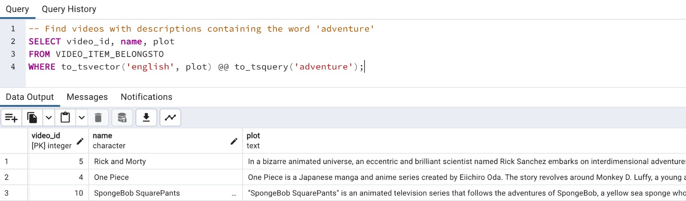
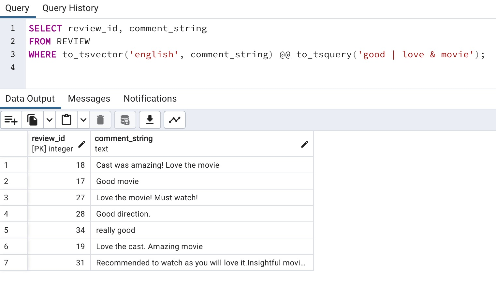
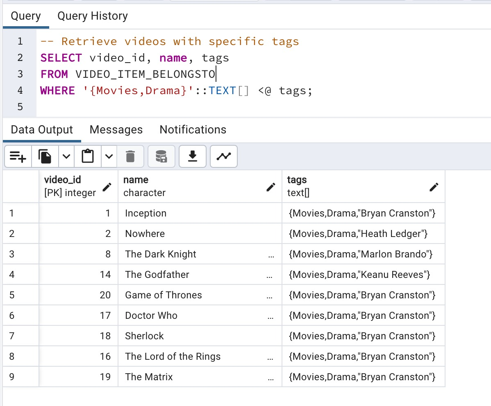
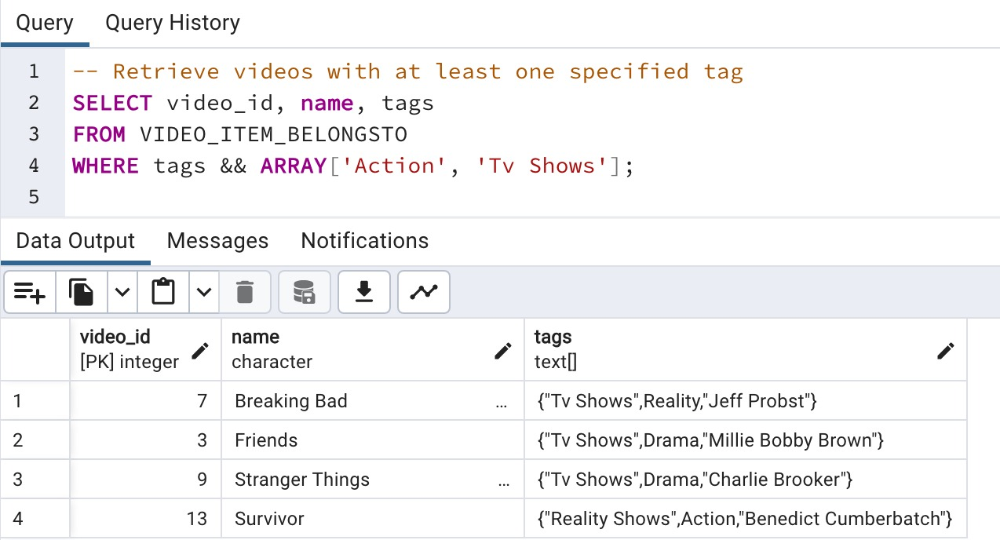
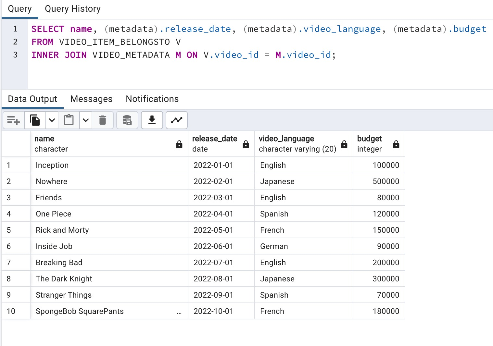
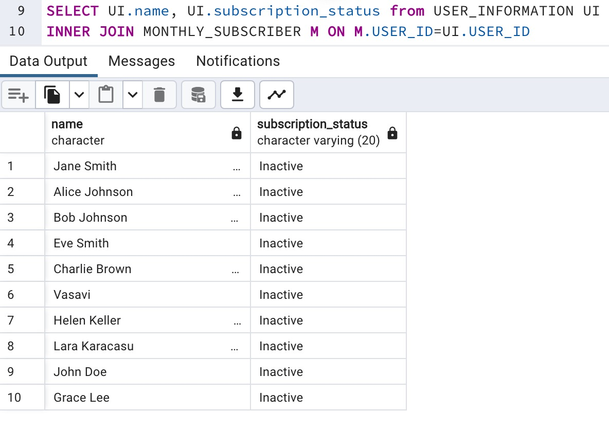
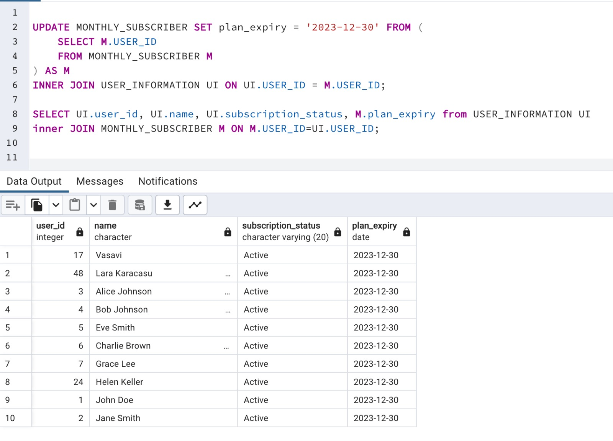
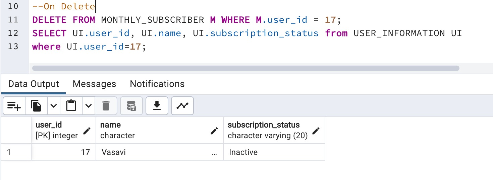

# Project 2 README

## Team Members
- Teammate 1: [Nithishma Allu na3062]
- Teammate 2: [Nagavasavi Jeepalyam nj2506]

## PostgreSQL Account
- Database on the server is associated with na3062.

## Schema Expansion Details

### 1. Text Attribute Addition

**Objective:**
Add a text attribute to enable full-text search on document-style data.

**Rationale:**
To enhance the search capabilities of the database and provide users with the ability to search for videos based on textual content, we added a 'plot' attribute to the `VIDEO_ITEM_BELONGSTO` table.

We have also upgraded the comments to a 'TEXT' attribute to enhance user experience. This change allows users to perform comprehensive full-text searches, making it easier to select videos based on their preferences and gain insights into reviews. 

**SQL Statements:**
```sql
-- Add text attribute 'plot' to VIDEO_ITEM_BELONGSTO
ALTER TABLE VIDEO_ITEM_BELONGSTO
ADD COLUMN if not exists plot TEXT;

--Updated the type of 'comments_string' in REVIEW
ALTER TABLE REVIEW
ALTER COLUMN comment_string TYPE TEXT
```

### 2. Array Attribute Addition

**Objective:**
Add an array attribute to store multiple categories, genres, and cast of each video.

**Rationale:**
To efficiently represent and query multiple categories, genres, and cast associated with each video, we added a 'tags' array attribute to the `VIDEO_ITEM_BELONGSTO` table.

**SQL Statements:**
```sql
-- Add array attribute 'tags' to VIDEO_ITEM_BELONGSTO
ALTER TABLE VIDEO_ITEM_BELONGSTO ADD COLUMN IF NOT EXISTS tags TEXT[];
```
## New Composite Type

### 3. Video Metadata Composite Type

**Objective:**
Define a new composite type for video metadata and create a new table using this composite type.

**Rationale:**
To organize and store metadata associated with each video, we defined a composite type 'video_metadata_type' and created a new table `VIDEO_METADATA` to utilize this type.

**SQL Statements:**
```sql
-- Define composite type for video metadata
CREATE TYPE video_metadata_type AS (
    release_date DATE,
    language VARCHAR(20),
    budget INT
);

-- Create a new table using video_metadata_type
CREATE TABLE VIDEO_METADATA (
    video_id INT PRIMARY KEY,
    metadata video_metadata_type,
    FOREIGN KEY(video_id) REFERENCES VIDEO_ITEM_BELONGSTO ON DELETE CASCADE ON UPDATE CASCADE
);
```

## Trigger Addition

### 4. Subscription Status Trigger

**Objective:**
Create a trigger to update the subscription status based on subscription plans.

**Rationale:**
To automatically update the subscription status of users based on their subscription plans, we created a trigger that executes a function to perform the necessary updates.

**SQL Statements:**
```sql
CREATE OR REPLACE FUNCTION na3062.update_subscription_status()
 RETURNS trigger
 LANGUAGE plpgsql
AS $function$
BEGIN
    UPDATE USER_INFORMATION
    SET subscription_status = 
        CASE
            WHEN EXISTS (
                SELECT 1
                FROM MONTHLY_SUBSCRIBER MS
                WHERE MS.user_id = NEW.user_id AND MS.plan_expiry >= CURRENT_DATE
            ) OR EXISTS (
                SELECT 1
                FROM ANNUAL_SUBSCRIBER ASB
                WHERE ASB.user_id = NEW.user_id AND ASB.expiry >= CURRENT_DATE
            )
            THEN 'Active'
            ELSE 'Inactive'
        END
    WHERE user_id = NEW.user_id;

    RETURN NEW;
END;
$$ LANGUAGE plpgsql;


-- Create a trigger for monthly subscriber updates
CREATE TRIGGER update_subscription_status_monthly
AFTER INSERT OR UPDATE OR DELETE ON MONTHLY_SUBSCRIBER
FOR EACH ROW
EXECUTE FUNCTION update_subscription_status();

-- Create a trigger for annual subscriber updates
CREATE TRIGGER update_subscription_status_annual
AFTER INSERT OR UPDATE OR DELETE ON ANNUAL_SUBSCRIBER
FOR EACH ROW
EXECUTE FUNCTION update_subscription_status();
```

## Queries
### 1. Full-text Search Query
```sql
-- Find videos with descriptions containing the word 'adventure'
SELECT video_id, name, plot
FROM VIDEO_ITEM_BELONGSTO
WHERE to_tsvector('english', plot) @@ to_tsquery('adventure');
```
**Result:**


```sql
-- Find REVIEWs with comment containing the words 'good' or 'love' and the word 'movie'
SELECT review_id, comment_string
FROM REVIEW
WHERE to_tsvector('english', comment_string) @@ to_tsquery('good | love & movie');
```

**Result:**


### 2. Array Access Query
```sql
-- Retrieve videos with specific tags
SELECT video_id, name, tags
FROM VIDEO_ITEM_BELONGSTO
WHERE '{Movies,Drama}'::TEXT[] <@ tags;
```
**Result:**


```sql
-- Retrieve videos with atleast one specified tag
SELECT video_id, name, tags
FROM VIDEO_ITEM_BELONGSTO
WHERE tags && ARRAY['Action', 'Tv Shows'];
```
**Result:**



### 3. Composite Type Query
```sql
-- Retrieve video information and metadata information
SELECT name, (metadata).release_date, (metadata).video_language, (metadata).budget
FROM VIDEO_ITEM_BELONGSTO V
INNER JOIN VIDEO_METADATA M ON V.video_id = M.video_id;
```
**Result:**


### 4. Trigger Example
**Event:**
Insertion of a new record into the MONTHLY_SUBSCRIBER table or an update on existing record.

**Trigger Action:**
The trigger (update_subscription_status_monthly) updates the subscription status in the USER_INFORMATION table based on the user's monthly subscription plan.

**Before Trigger:**
```sql
SELECT UI.name, UI.subscription_status from USER_INFORMATION UI
INNER JOIN MONTHLY_SUBSCRIBER M ON M.USER_ID=UI.USER_ID
```
**Result:**



**Trigger On UPDATE:**

```sql
--On Update
UPDATE MONTHLY_SUBSCRIBER SET plan_expiry = '2023-12-30' FROM (
    SELECT M.USER_ID
    FROM MONTHLY_SUBSCRIBER M
) AS M
INNER JOIN USER_INFORMATION UI ON UI.USER_ID = M.USER_ID;

SELECT UI.user_id, UI.name, UI.subscription_status, M.plan_expiry from USER_INFORMATION UI
inner JOIN MONTHLY_SUBSCRIBER M ON M.USER_ID=UI.USER_ID;
```
**Result:**


**Trigger On DELETE:**

```sql
--On Delete
DELETE FROM MONTHLY_SUBSCRIBER M WHERE M.user_id = 17;
SELECT UI.user_id, UI.name, UI.subscription_status from USER_INFORMATION UI
where UI.user_id=17;
```
**Result:**



